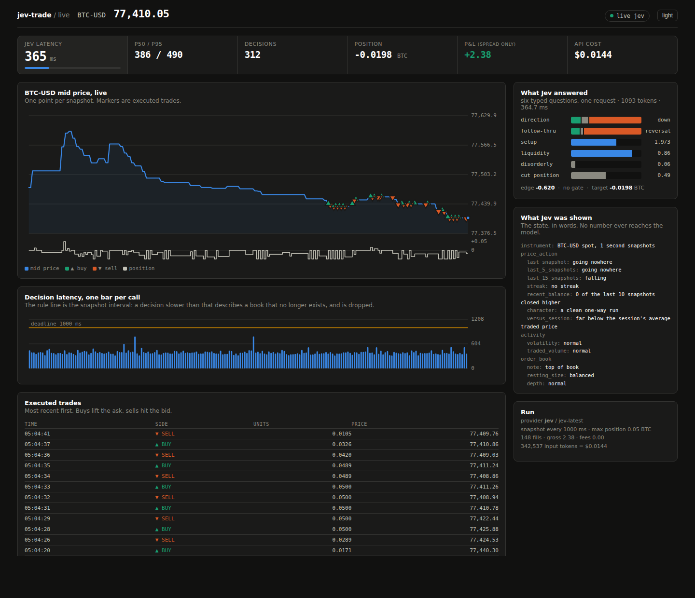

# jev-trade

A simulated high-frequency crypto trading loop that makes its buy/sell calls with
[**Jev**](https://typesafe.ai/blog/introducing-system-one-models-and-jev), TypeSafe AI's
System One model.

Recent prices and volumes for BTC/ETH go in; a typed, confidence-aware decision
comes out; a cost-aware execution simulator turns it into P&L you can actually
argue with.

---

## One correction to the brief

The task description said Jev's output latency is *extremely slow*. It is the
opposite, and the difference matters for this design.

TypeSafe reports **70–500 ms end-to-end**, against 3–329 s for frontier
models, because Jev does not generate tokens at all — a parallel sampler emits
every answer in one shot. That speed is precisely *why* it suits
["System One"](https://docs.typesafe.ai/concepts/system-one) work: fast,
intuitive, low-deliberation judgment, the kind a human scalper does at a glance.
A genuinely slow model would be unusable here, for reasons this repo measures
rather than asserts (see [The latency experiment](#the-latency-experiment)).

The rest of the brief stands, and the design follows it: a fast, natively
structured decision model is a good fit for reading a tape.

Everything below still holds if you disagree about the latency. The engine
treats latency as a tunable, not an assumption — `--extra-latency-ms` lets you
simulate a model of any speed and watch what it does to the strategy.

---

## What it does

```
 Kraken / synthetic feed          all arithmetic lives here
        │                    ┌──────────────────────────────┐
        ▼                    │  features.py   returns, vol, │
   ┌─────────┐               │                z-scores,     │
   │  ticks  │──────────────▶│                imbalance     │
   └─────────┘               └──────────────┬───────────────┘
                                            ▼
                             ┌──────────────────────────────┐
                             │ discretize.py  numbers→words │
                             └──────────────┬───────────────┘
                                            ▼  state (words only)
                             ┌──────────────────────────────┐
                             │  POST /v1/systemone          │
                             │  6 typed questions, 1 call   │◀── jev-latest
                             └──────────────┬───────────────┘
                                            ▼  typed answers + confidence
                             ┌──────────────────────────────┐
                             │  policy.py    answers→units  │
                             └──────────────┬───────────────┘
                                            ▼
                             ┌──────────────────────────────┐
                             │  engine.py    latency, gates │
                             │  execution.py fills, fees    │
                             └──────────────────────────────┘
```

The governing rule comes from TypeSafe's own
[jaggedness notes](https://docs.typesafe.ai/model-jaggedness/jev-1.13):

> *"Jev is not a calculator. We strongly recommend implementing any mathematical
> logic in code."*

So **code owns every number and Jev owns every judgment.** The model is never
asked what 76,412.30 minus 76,398.10 is, or whether that gap is large. It is
asked whether the tape leans one way, and it answers with a probability
distribution over options we defined.

## Quickstart

No dependencies, no build step, Python 3.10+.

```bash
python -m jevtrade.cli backtest --baselines     # run and score the loop
python -m jevtrade.cli decide                   # one decision, fully unpacked
python -m jevtrade.cli sweep                    # what latency costs you
python -m jevtrade.cli fetch --symbol ETH       # real bars from Kraken
python -m jevtrade.cli listing --provider mock  # read exchange announcements
python -m jevtrade.cli fx --provider mock       # read central banks, graded on spot FX
```

Without `TYPESAFE_API_KEY` the loop runs against an offline stub and says so,
loudly, on every report. With a key it calls the real thing:

```bash
export TYPESAFE_API_KEY=sk-...
python -m jevtrade.cli models
python -m jevtrade.cli backtest --provider jev
```

## The Jev integration

Three files carry it. They are worth reading in this order.

### 1. `discretize.py` — numbers become words

Jev is documented as weaker on numeric representations than semantic ones, so
no float ever reaches it. The raw features stay on the decision record for the
audit trail; the model sees this:

```json
{
  "instrument": "BTC-USD spot, 250 ms snapshots",
  "price_action": {
    "last_snapshot": "drifting up",
    "last_5_snapshots": "rising",
    "last_15_snapshots": "rising hard",
    "streak": "7 consecutive up ticks",
    "recent_balance": "8 of the last 10 snapshots closed higher",
    "character": "a clean one-way run",
    "versus_session": "far above the session's average traded price"
  },
  "activity": { "volatility": "normal", "traded_volume": "light" },
  "order_book": {
    "resting_size": "heavily weighted to buyers",
    "depth": "thinner than usual",
    "cost_to_cross_the_spread": "small next to a typical move"
  },
  "our_book": { "exposure": "slightly long", "open_position_pnl": "a small gain" }
}
```

Every bucketed value comes from a closed vocabulary, and a test asserts it.

One choice worth calling out: the spread is described *relative to the typical
tick move*, not in basis points. "Costs about as much as a typical move to
cross" is the fact that decides whether a scalp is viable. "3.4 bps" is not a
judgment, it is a number, and numbers are our job.

### 2. `questions.py` — six judgments, one request

Jev ingests the state once and evaluates every question against it in parallel,
so extra questions cost a few tokens and almost no latency
([speculative fan-out](https://docs.typesafe.ai/patterns/fan-out)). One broad
"should I trade this?" is therefore split into six atomic ones:

| id | type | asks |
|---|---|---|
| `direction` | Choice | up / down / unclear |
| `follow_through` | Choice | continuation / reversal / no pattern |
| `setup_quality` | Score | how much the parts of the tape agree, on a 4-level rubric |
| `liquidity_ok` | Noul | can we open normal size right now? |
| `disorderly` | Noul | is this a dislocation to stay out of? |
| `cut_position` | Noul | should the open position be reduced? |

Choice is *relative* (which option wins) and Noul is *absolute* (whether a
condition holds). TypeSafe warns these are not comparable to each other, so the
policy never mixes their thresholds.

### 3. `policy.py` — answers become a quantity

The model never sees a position size. Code combines the six answers with
weights that live in a dataclass, so tuning the strategy means changing a
number in `PolicyConfig`, not rewriting a prompt:

```
edge        = P(up) - P(down)                    # from the Choice distribution
conviction  = setup_quality rescaled to 0..1
multiplier  = follow-through and confidence adjustments
target      = clamp(edge × conviction × multiplier × gain) × max_units
```

then five hard gates in order — `disorderly`, `cut_position`, `low_confidence`,
`weak_setup`, `no_edge` — plus an `illiquid` gate that blocks *increases* but
never blocks an exit. A thin book must not be able to trap us in a position.
Every gate has a test.

## Reading the output honestly

A backtest is the easiest thing in finance to lie with. Four things to know
before believing any number this repo prints.

**1. The default provider is not Jev.** Jev is a closed API behind an
early-access waitlist. Without a key you get `MockJevClient`, a hand-written
scoring function over the same vocabulary the model sees. It reads only the
state dict, so it has no oracle access to the simulator's hidden state — but it
is not a model, and every report it produces is stamped `provider=mock`.
Numbers from it describe this repo's plumbing and nothing else.

**2. The synthetic tape has a known, planted edge.** `SyntheticFeed` runs a
hidden AR(1) process that biases the next return *and* leaks into the
observable book imbalance. So book imbalance genuinely predicts the next move,
by an amount you set with `--alpha`. This is deliberate: it makes the harness
interpretable. With `--alpha 0` there is nothing to find, and a test asserts
that a book-reading rule earns nothing on such a tape. Finding an edge in a
market that was built to contain one is not evidence about a model.

**3. The default run loses money, and that is the correct result.** Here is a
default backtest:

```
P&L
  gross              28.90
  fees              -91.60
  net               -62.69   (-0.825% of capital at risk)

Risk
  turnover      915,968  over 250 fills
  break-even fee  0.316 bps   (the strategy is viable only below this taker fee)

Decisions
  hit rate      67.8% over 339 calls   (scored where the decision was formed)
```

A 67.8% hit rate and still a loss. The edge is worth about 1 bp over an
eight-tick hold, while a round trip costs the 0.25 bp spread plus 2 × 1 bp of
taker fees. **No amount of predictive accuracy survives costs that exceed the
edge.** That is the central fact of high-frequency trading, and a harness that
hid it would be worthless.

The `break-even fee` line names the number that actually decides viability:
at 0.316 bps this strategy needs a top-tier fee schedule or maker rebates, not
a retail account. Run `--fee-bps 0.2` and it turns a profit; `--fee-bps 2` and
it is hopeless. Set `--fee-bps 0` to see the raw signal with no costs at all.

**4. Compare against the baselines, not against zero.** `--baselines` runs
rule-based strategies over the identical ticks, identical costs and identical
one-tick execution delay:

```
strategy                 net       gross       fees   fills      maxDD     hit
------------------------------------------------------------------------------
jev (mock)            -62.69       28.90      91.60     250      71.40   67.8%
flat                    0.00        0.00       0.00       0      -0.00       -
buy_and_hold          101.75      102.51       0.76       1      36.27       -
momentum             -233.70      -73.69     160.01     300     249.84       -
mean_reversion       -321.45     -161.43     160.01     300     323.76       -
imbalance            -214.34       -6.73     207.61     264     237.93       -
random               -486.34     -230.20     256.14     241     492.39       -
```

The decision loop is the only strategy with positive gross P&L — its gating
keeps it out of trades the raw `imbalance` rule takes and loses on. And
`buy_and_hold` wins outright, because this particular seed drifted up. That is
a coin flip on the seed, not a benchmark anyone beat.

There is also a **calibration table**, because calibrated probabilities are
Jev's central claim and the policy's confidence thresholds are only as sound as
that calibration:

```
Calibration of P(up | directional)
  bucket      n    predicted   realised
  0.0-0.2    291     0.05       0.34
  0.8-1.0    290     0.95       0.65
```

That is the mock being badly overconfident, which is exactly what the table is
for. Run it against the real model and see.

## The latency experiment

`sweep` holds everything else fixed and varies only how long the decision takes
to come back, averaged over several paths:

```
 added latency  decisions  dropped  skipped   formed  executed      gross        net
------------------------------------------------------------------------------------
          0 ms        742        0        0   63.2%     61.8%      88.44    -107.19
        300 ms        742        0        0   63.2%     61.3%      72.05    -125.66
       1200 ms        742        0        0   63.0%     60.1%      38.38    -156.52
       3000 ms        373        0      369   63.0%     54.3%      12.29    -100.33
```

`formed` scores each call from the tick it was made on; `executed` scores the
*same call* from the tick it actually reached the market. They separate two
things that get confused:

- **The judgment never degrades.** `formed` is flat at ~63% at every latency.
  A slow model is not a worse analyst.
- **The market moves on.** `executed` decays to 54.3% — near a coin flip — and
  gross P&L falls 86%. The answer was right about a tape that no longer exists.

At 3000 ms the loop also *skips* 369 decision points, because only one request
is ever in flight. A slow provider does not merely act late; it gets fewer
looks at the market.

Set `--deadline-ms 400` and late decisions are dropped outright rather than
acted on, which is the only safe policy: a stale read of the tape is worse than
no read. Jev's documented 70–500 ms sits inside that budget. A model in the
3–329 s range does not, which is the quantitative version of the correction at
the top of this file.

Two safeguards run in code on every tick, independent of the model — a stop
loss and a drawdown kill switch. Nothing that requires a network call should be
the only thing between a position and a loss.

## The live demo

```bash
export TYPESAFE_API_KEY=sk-...
python -m jevtrade.server            # http://127.0.0.1:8787
```

A page that watches Jev trade a live BTC curve, one decision per second.



The point of the page is the **latency budget**. Every snapshot is a 1000 ms
window, and the hero tile shows how much of it the decision consumed —
typically a third. The bar chart puts one bar per call under a rule line at the
deadline: a decision slower than one snapshot describes a book that no longer
exists, so it is dropped rather than traded. Measured over a live session:

```
p50 386 ms   ·   p95 490 ms   ·   0 dropped out of 366 decisions
1093 input tokens per decision = $0.000046
```

The right-hand column is the part worth watching: `What Jev was shown` is the
state in words, and `What Jev answered` is the six typed answers with their
probability distributions, updating live. You can watch a Choice swing from
`up` to `down` and see the gate that follows from it.

This path uses **Kraken's ticker, which carries the real best bid and ask with
their resting sizes** — unlike the 1-minute OHLCV replay above, where the book
has to be reconstructed. The feature window is primed from the public trade
tape, so the demo starts trading immediately instead of waiting a minute.

Notes on what the P&L means: trades cross the real spread, but no exchange fee
is modelled by default (`--fee-bps` adds one), and it is paper trading against
observed prices, not order placement. It is a demo of a decision loop, not a
trading result.

```
--symbol BTC|ETH|SOL   --port 8787        --interval-ms 1000
--max-units 0.05       --fee-bps 0        --provider auto|jev|mock
```

The API key stays in the server process; the browser never sees it. Without a
key the page runs the offline simulator and says so. `?static=1` renders one
snapshot instead of holding the stream open, and `?theme=light` forces a mode.

`tools/record_session.py` captures a run's event stream to JSON, which is how
the shareable replay of a real session was built — 199 live decisions, three of
which came back past the deadline and were dropped.

## Market making: where this model actually fits

The directional strategy above is the wrong job for Jev, and the numbers say so
— a taker needs a sub-0.32 bp fee to survive, and predicting direction is the
one thing a System One model is weakest at.

Market making is the better fit, for a reason worth stating precisely. The
mechanical part — quote both sides, earn the spread, lean against inventory —
is arithmetic, and a traditional program does it better than any model. What
kills a market maker is **adverse selection**: getting picked off by someone
who knows something. Deciding *"is now a bad time to be showing this side"* is
a defensive, low-cardinality judgment over text, and it has to be made in
hundreds of milliseconds. That intersection is the niche: too semantic for a
rule, too fast for a frontier model.

```bash
python -m jevtrade.cli mm --seeds 20                  # the comparison
python -m jevtrade.cli mm --event-impact-bps 0        # the falsifiability run
```

### Jev goes off the quote path

```
quoting engine (pure code, every tick) ──> bid / ask
        ▲ reads, never waits
   risk posture  {per-side spread, per-side size, ttl}
        ▲ lands ~400 ms later
   Jev ◀── a headline arrives, or the tape turns one-sided
```

The quoter never blocks on a network call. Jev sets a *posture*; code sets
quotes. This is what makes the latency budget survivable: a stale posture is
merely conservative, while a stale directional bet is fatal. If the model is
slow or down, the stance defaults to defensive.

It also buys something a volatility trigger structurally cannot do. Knowing the
direction lets you **pull the side about to be picked off and keep quoting the
other** — protected and positioned at once. A vol spike has no direction, so it
can only widen both sides.

And uncertainty has a safe direction here, which it does not in directional
trading. There, low confidence means stand aside and earn nothing. Here it
means quote wider and keep earning. Calibrated confidence maps onto a continuum
of profitable states rather than an on/off switch.

### The experiment

Four arms over identical markets — the price path and event schedule run on
their own RNG stream, so every arm sees the same tape:

| arm | what it does |
|---|---|
| `naive` | quotes through everything |
| `vol` | widens both sides when realised vol spikes — the traditional defence |
| `keyword` | pauses quoting on a news word — what desks actually run |
| `jev` | reads the headline and the tape, sets a stance per side |

Counterparties are a mix of **noise flow** (fill probability decays with quote
distance) and **informed flow** (arrives after a material event, trades the way
the price is about to move, and crosses only while the quote is cheap relative
to the move it already knows about). Without that asymmetry a market-making
backtest is meaningless — quoting a random walk always "wins".

Scoring is by **markout**, the only measure that tells a market maker anything:
each fill splits into the half-spread captured at the fill and what the mid did
afterwards. The second term is adverse selection.

The `keyword` arm is built to be a *strong* competitor: its dictionary catches
all six obviously material headlines in both directions. Its only failures are
the four deliberately subtle ones and the seven it cannot read — denials and
re-reports. Beating a strawman would prove nothing.

### Results

20 independent markets, 6,000 ticks each, real `jev-latest`:

```
arm           mean net   std error    vs naive
----------------------------------------------
naive            1,755         767          +0
vol              1,500         928        -255
keyword          8,820         900      +7,066
jev              5,829         752      +4,074

paired jev - keyword: -2,991 +- 654  (outside the noise)
jev precision 97%   recall 62%
```

**The keyword rule wins, and the gap is real.** Jev's reading is close to
perfect — it flags 97% of its stances on genuinely material news, and in a
separate check it scored `p(denied) = 0.99` on every denial and freshness
`0.11` on every re-report — but it acts on only 62% of material events, and in
this world a miss costs more than a false alarm.

The falsifiability run makes the trade-off visible. Set `--event-impact-bps 0`
so headlines print but the price never moves, and every defensive stance is
pure cost:

```
naive           20,479          +0
keyword         13,993      -6,486   (-32%)
jev             19,689        -791   ( -4%)
```

Jev's false alarms cost **eight times less**. That is precision, measured.

So there is a crossover, and it sits at how much of the flow is informed:

```
 toxicity    naive  keyword      jev   jev-kw   +-se  winner
     0.00   20,333   19,092   20,828   +1,736    717  jev
     0.25   15,183   16,876   16,725     -152    916  tie
     0.50   11,303   13,462   12,083   -1,379    470  keyword
     1.00    3,391   10,127    5,266   -4,861    778  keyword
     1.50   -4,757    5,478     -885   -6,363  1,145  keyword
```

**Precision pays when false alarms dominate; recall pays once adverse selection
does.** If your news feed is mostly noise, reading it is worth a lot. If every
event is a real 20 bp move, pausing on everything is hard to beat.

Two things that did *not* work, recorded because they were predictions:
acting harder once the floor is cleared made things worse (the lost spread
exceeds the protection), and raising the event rate did not tip the balance
toward precision — more news means more *material* news too.

### What this does not show

- **The world is built so that semantics matter.** Denials and re-reports are
  55% of the event mix by construction. Measured against real feeds (see the
  next section) the real figure is closer to 95% non-material — noisier than
  assumed, which favours precision, but on a feed with no forward signal left
  in it.
- **The "subtle" labels are fiat.** Four headlines are written to read as
  immaterial while the simulator moves the price 22 bp anyway. Jev reads them
  as immaterial — as would a person. Most of the recall gap is these, so it may
  be an artifact of my labelling rather than a limit of the model.
- **Jev is a sampler.** Re-drawing its answers moved a single configuration by
  ~30%. Every number here fixes one set of answers across all arms and reports
  a standard error across markets; treat differences smaller than ~2 standard
  errors as nothing.
- Fills, impact and flow are a model, not an exchange. No queue position, no
  cancel latency, no fee tiers or rebates — and rebates are most of why real
  market making works.

## Does real news flow look like that? (measured)

The market-making experiment rests on one assumption: that a useful share of
real headlines are the kind a keyword rule misreads. That is testable, and
unlike the synthetic world it has a ground truth nobody has to label — **what
the price actually did afterwards**.

```bash
python -m jevtrade.cli news
```

209 de-duplicated headlines from 11 public crypto RSS feeds over 58 hours,
aligned to 5-minute BTC bars. A headline "moved" if BTC made a ≥2σ excursion in
the next 15 minutes *and* was not already moving in the 15 before — because a
move already underway is one you are too late to trade. The control throughout
is **randomly timed fake headlines** over the same window.

```
arm                   alerts   fire  moved    null      z
all headlines            209  100%   5.7%    5.0%   +0.47
keyword rule              67   32%   9.0%    5.1%   +1.37
jev top-40                40   19%   2.5%    5.0%   -0.74
```

Nothing clears the noise. Crypto headlines as a class are followed by a
material move about as often as a randomly chosen moment is.

### The crux

That comparison is not yet decisive, because news clusters around busy moments
and a busy moment stays busy on its own. So the real test holds recent
volatility fixed: each flagged headline is compared against random moments with
a comparable move already behind them.

```
group         condition            n   after    null      z
jev top-40    quiet before        27    0.51    0.53   -0.22
jev top-40    already moving      13    1.71    0.79   +4.12
keyword       quiet before        41    0.55    0.53   +0.30
keyword       already moving      26    1.28    0.78   +3.21
```

**A headline arriving into a quiet tape predicts nothing** — z ≈ 0 for both
arms, and this is the well-controlled half of the table. The "already moving"
rows look strong, but those are headlines *reporting* a move in progress, and
the volatility matching there is coarse enough that the number is not evidence
of anything.

The qualitative read tells the same story. Jev's highest-risk headlines are
exactly the ones a person would pick out:

```
0.268   SEC releases long-awaited innovation exemption
0.259   Fed Hikes Rates for the First Time Since 2023, Bitcoin Spikes
0.196   Binance Alert: System Upgrade to Suspend Deposits and Withdrawals
0.176   Bank of Japan Follows Fed and ECB With Rate Hike to 1.25%
```

The second one says it outright. By the time an article about a Fed decision is
written, edited and published to RSS, the spike it describes is history.

### What this settles, and what it does not

**The distribution assumption is half right, in the direction that matters.**
Real flow is far noisier than the simulation assumed — roughly 95% of headlines
are followed by nothing, against 55% non-material in the synthetic mix. That
pushes the operating point deep into the regime where precision beats recall,
which is exactly where Jev won and the keyword rule bled (−4% versus −32%). On
this feed a keyword rule fires on **32%** of everything, so at a ~5% base rate
at least six of every seven alerts are false by arithmetic alone.

**But the premise underneath it does not survive as stated.** There is no
tradeable forward signal here to be precise about. Jev reads the headlines
correctly — its risk scores top out at 0.27, i.e. it judges almost nothing on
this feed to be materially BTC-moving, which the tape agrees with — and reading
them correctly is worth nothing when the information has already been priced.

The likely culprit is the data source, not the model. RSS publication
timestamps trail the underlying event by minutes; news desks that trade on
headlines use millisecond-stamped wire feeds. So the honest scope of this
result is: **consumer crypto RSS carries no tradeable forward information at
5-minute resolution.** It is not a finding about news in general.

Other limits worth holding onto: 209 headlines over one quiet 58-hour window is
a small sample and underpowered for rare events; 5-minute bars are coarse for a
reaction that happens in seconds; and only BTC was tested. Settling this
properly needs a low-latency wire feed with millisecond stamps and an L2 book —
which is the experiment to run before building anything on this idea.

## Composed judgment: reading an announcement in one second

The news study above put Jev on the wrong end of a trade-off. A headline that
moves the market is rare and worth a lot, so whoever trades it can afford
five seconds and five cents of a frontier model; a 400 ms answer buys nothing
there. Jev's advantage — frontier-grade judgment, cheap, fast — pays where
there are *many* judgments to make and each one is worth little. And, as it
turns out, where several of them have to be composed.

### Width is free, depth costs a round trip (measured)

Against the real API, from this sandbox, with a ~1k-token document:

```
questions per request      median latency
   1                          412 ms
   6                          420 ms
  24                          392 ms

5 sequential rounds × 6 questions, each round given the previous answers:
  2.0–2.4 s, about 400 ms per round
```

Ten judgments cost the same as one if they share a request. The budget is
therefore *rounds* — conditional layers, "ask A, then depending on A ask B" —
not judgments. One second buys two rounds from here and perhaps three to five
from a colocated box, each carrying dozens of questions. So a judgment tree
built on this model should be **wide and shallow**, which is also what keeps
errors from compounding: ten sequential 90%-accurate steps are 35% accurate,
two wide ones are not.

### The opportunity: exchange listing announcements

Binance publishes listings, delistings and every other notice through one
public CMS endpoint with a millisecond `releaseDate` — the same endpoint the
public "listing sniper" bots poll. Those bots are fast enough. What they cannot
do is read: they match the title (`Will List`, `Removal`) and trade every
ticker in it. That fails on exactly the announcements that carry the most
money — three tickers where one is the subject, a pair removal that is not a
delisting, a "Will Remove the Seed Tag" that the word `remove` turns into a
short, a Seagate `(STX)` that buys Stacks.

`jevtrade/listing/` reads each announcement with a two-round tree:

* **Round one, wide and speculative:** what kind of notice is this (listing,
  more markets for an existing token, delisting, warning tag, housekeeping,
  tokenized stock), which way it cuts, how big, is it conditional — and, for
  every ticker the *code* found in the text, whether that ticker is what the
  announcement is about rather than a quote currency, collateral or a passing
  mention. Jev never returns a string, so extraction is code and judgment is
  the model.
* **Round two, only if a ticker cleared that bar:** the direction for each
  such token specifically, a reversed-framing check ("would a holder have no
  reason to act?") whose errors are partly independent of the first framing,
  and whether the substance was already public. No second round, no trade.

Every number is arithmetic on the model's probabilities; the model computes
nothing. On six recent, deliberately varied announcements against the real
API the reader took **0.89–0.97 s** for two rounds (0.45 s when it stopped
after one), on 2–4k input tokens — about $0.0001 per announcement.

### How it will be graded

```bash
python -m jevtrade.cli listing --days 180            # real key: reads with Jev
python -m jevtrade.cli listing --days 30 --provider mock
```

Every arm turns an announcement into (token, side) signals and every signal is
scored the same way: enter at the open of the minute *after* the release —
deliberately up to 59 seconds late for a reader that answers in one — and
take the signed log return at 1, 5, 15 and 60 minutes, on Binance if the
token still trades there, else OKX, else Coinbase, in that fixed order for
every arm. The null is the same tokens and sides at random moments within
five days, so whatever drift those tokens had that week the null has too. The
release minute itself is reported but never credited to anyone.

Three controls sit beside the reader: the title-matching bot (the incumbent),
the same rules over tickers from the body as well (so that *seeing* the body
and *judging* it are separable), and every mentioned ticker bought (the base
rate for being mentioned at all). Model answers are cached on disk per
announcement, so the threshold sweep and every re-run score one fixed set of
answers rather than re-sampling the model. The run has not been done yet; the
numbers will go here when it has.

## The same reader, pointed at central banks

The listing study aims the reader at a feed whose incumbent is fast but cannot
read. This one aims it at a feed whose incumbent *can* read and is slow — a
human on a desk with two statements side by side — and where the part a machine
can already handle is gone before anyone blinks.

**The thesis, stated so it can fail.** In FX the numeric releases are priced
within five minutes: NFP, CPI and the headline rate itself are numbers, every
machine on the tape has them at the same millisecond, and the trade is
subtraction. The *text* events are not. A rate-decision statement, a set of
minutes, a press conference, a speech, a line about the exchange rate being
"excessive and one-sided" — these keep moving price for fifteen to sixty minutes
because somebody has to read them first. A model that answers thirty questions
about a statement in one 400 ms round is early relative to a fifteen-minute
digestion. That window, and nothing wider, is what `jevtrade/fx/` tests.

### Why this window and not another (measured, one week, small)

Median |move| in bps on the spot pair of the event's currency, over the
ForexFactory calendar for 2026-09-14 to 09-18, Yahoo 5-minute bars:

| events | n | +5m | +15m | +30m | +60m |
|---|---:|---:|---:|---:|---:|
| High impact, numeric | 10 | 2.2 | 5.7 | 4.2 | 6.6 |
| High impact, text | 4 | 3.3 | **12.1** | **19.5** | **20.0** |
| Medium impact, numeric | 7 | 1.6 | 3.6 | 1.2 | 3.5 |
| Medium impact, text | 4 | 2.3 | 5.2 | 4.6 | 8.2 |

The caveats are larger than the table: **one calendar week, four High-impact
text events, and 5-minute bars**, which is an anecdote with a standard error,
not a result. It is here because it is what motivated building the thing, and
because the shape is what the thesis predicts — numeric events flat after five
minutes, text events still going at sixty.

The individual cases say the same thing more legibly. The BoJ press conference
on 2026-09-18 moved USDJPY **0.6 bp in five minutes and 23.9 bp in fifteen**:
nothing happens while it is being read, and then it happens. The 2026-09-16 FOMC
statement differs from the 2026-07-29 one in **7 of its 9 sentence slots**, and
the hike itself was on the calendar — 4.00% against 3.75% previous — so the
number was not the news. The reading was in the changed sentences: the inflation
paragraph went from "elevated relative to the Committee's 2 percent goal, in
part reflecting supply shocks" to a flat "Inflation remains elevated," and the
vote went from **9–3 with three dissents for a hike** to **12–0**.

(With the site chrome left in the page, as a first pass did, the same pair of
statements reads as 11 changed slots out of 27; the counts above are after the
body extraction in `documents.py` throws the navigation away. Same story, fewer
sentences.)

### The feeds

| source | reachable | depth | timestamp |
|---|---|---|---|
| `federalreserve.gov/json/ne-press.json` | yes | 4633 rows to 2006 | US Eastern local, minute; 468 old rows have none |
| `…/ne-speeches.json` | yes | 1336 rows | same |
| `…/ne-testimony.json` | yes | 280 rows | same |
| Fed statement / speech pages | yes | immutable | — (body text) |
| ECB `rss/press.html` | yes | last 15 items | RFC 2822, `+0200` |
| BoJ `en/rss/whatsnew.xml` | yes | last 44 items | `+0900`; links are usually PDFs |
| BoE `rss/news` | yes | last 50 items | `+0100` |
| ForexFactory `ff_calendar_thisweek.json` | yes | **this week only** | ISO with offset |
| Yahoo `v8/finance/chart/{sym}` | yes | 60d of 5m, 7d of 1m | epoch seconds, UTC |
| Dukascopy `datafeed/{SYM}/…/{HH}h_ticks.bi5` | yes | ticks back to 2003 | ms into the UTC hour |
| Reuters, Bloomberg, X API | no | — | — |

Only the Fed has an archive. Everything else is a window onto the last week or
two, which is why the Fed is the primary source and the other three are there to
show the tree is not Fed-shaped. `lastweek` and `nextweek` both 404 on the
calendar, so a `collect` step stores the current week under an ISO-week key and
the numeric-surprise baseline is live only for the weeks somebody ran it. No
calendar is ever reconstructed for a past week: a consensus invented after the
fact is not a consensus, and that arm would win for the wrong reason.

### The sign convention

Stated once, in one table, and tested:

| issuer | currency | hawkish means | pair traded | hawkish side |
|---|---|---|---|---|
| Fed | USD | USD strengthens | `EURUSD=X` | short |
| ECB | EUR | EUR strengthens | `EURUSD=X` | long |
| BoE | GBP | GBP strengthens | `GBPUSD=X` | long |
| BoJ | JPY | JPY strengthens | `JPY=X` (USDJPY) | short |

A hawkish Fed sends EURUSD down and a hawkish BoJ sends USDJPY down, because the
currency in question is the *quote* side of those pairs. Getting this backwards
inverts the entire study while leaving every number plausible, so it lives in
one dict and has its own test.

### The tree

**Round one, one request, everything speculative** — what kind of text this is
(rate decision, minutes, speech or testimony, press conference or interview, FX
or intervention comment, data or survey, operational, other), whether it is
policy at all, which way it leans for the issuer's own currency, whether there
is anything new in it, how big, whether the guidance moved, whether it is a
surprise against what the text implies was expected (and against the calendar
forecast, when a snapshot covers it), and how far it goes up a five-level
intervention ladder: *no mention of the exchange rate → officials are watching →
moves are "excessive or one-sided" → "ready to take decisive action", or a rate
check → intervention announced or confirmed.*

Then, for each of up to twelve sentences that changed since the previous edition
— found by `difflib` on sentence lists, not by the model — two more questions:
which way *that sentence* cuts, and whether the change is substance or
rephrasing. With a full diff that is **32 questions in one round**, and width is
free.

**Round two, only if round one found something** — a decisive stance, a material
sentence change, or intervention language near the top of the ladder. It asks
the direction again with the framing reversed ("if you had to take a position
for the next hour, which side?"), a holder check ("would a trader long this
currency be unaffected?"), and the horizon. Two rephrasings of one question make
partly independent errors; that is the cheapest redundancy there is. **No second
round, no trade** — a document whose confirmation never ran scores zero.

Every number is arithmetic on the probabilities: strength is stance × the
reversed-framing confirmation × magnitude × policy relevance, lifted a little by
surprise and halved by the complement of "new information". The model multiplies
nothing.

### The baselines and the grading

```bash
python -m jevtrade.cli fx --days 60                      # real key: reads with Jev
python -m jevtrade.cli fx --days 60 --provider mock      # offline, keyword stub
python -m jevtrade.cli fx --snapshot-calendar            # store this week's calendar
```

Four arms are scored the same way. **`keyword-bot`** counts hawkish words
against dovish ones and trades the difference — the incumbent, and the thing to
beat; it reads "the Committee no longer expects to raise rates and will not
tighten further" as hawkish. **`surprise-bot`** takes the printed rate minus the
snapshotted forecast, which is the incumbent that actually wins on numbers, and
reports *not available* for every week without a snapshot. **`all text`** trades
every document, so the table shows whether central-bank text moves the tape at
all relative to nothing happening — if that arm is flat, nothing downstream
matters. **`reader`** is the tree at a strength threshold.

Every signal enters at the open of the first bar *after* the published
timestamp — up to five minutes late on 5-minute bars, deliberately — and is
measured by signed log return at 5, 15, 30 and 60 minutes. The null is the same
pair and the same side at random moments within five days, drawn *only where the
tape has bars*: spot FX is shut from about Friday 21:00 to Sunday 21:00 UTC, so
a third of naive draws land in a hole, and a 60-minute return computed by bar
index across a Friday close would be a 51-hour return in disguise. Horizons are
therefore checked against the bars' own timestamps and dropped when the window
is not contiguous. Model answers are cached per document and tree version, so
the threshold sweep scores one fixed set of answers rather than re-sampling.

### Grading on ticks

Five-minute bars were the binding constraint, not the feed. Yahoo serves sixty
days of them, which is thirty documents and five reader trades; and a bar has no
bid and no ask, so every arm was being graded at a mid price nobody is quoted.
Dukascopy publishes free tick files back to 2003 for the majors and fixes both.

**The format** (probed from this environment, not assumed):

```
https://datafeed.dukascopy.com/datafeed/{SYMBOL}/{YYYY}/{MM}/{DD}/{HH}h_ticks.bi5
```

`MM` is **zero-based** — January is `00` — while `DD` and `HH` are ordinary
two-digit fields and `HH` is the UTC hour. The body is LZMA (`lzma.decompress`,
standard library). Decompressed it is consecutive 20-byte big-endian records,
`struct.unpack(">IIIff")` = *(milliseconds since the start of the hour, ask, bid,
ask volume, bid volume)*. Prices are integers scaled by **1e5**, or by **1e3**
when the quote currency is JPY: `115510 → 1.15510` on EURUSD, `156225 → 156.225`
on USDJPY. An hour with no ticks — every weekend hour of seventeen years, most
holidays — answers `200` with a zero-byte body, and a date the feed does not
have answers `404`; both are cached as "no ticks", because a run that re-asks for
every Saturday since 2009 spends its afternoon on them. A `5xx` or a dropped
connection is the opposite: transient, retried with backoff, and never cached,
since caching one would turn a bad minute of network into a permanent hole.

**The entry rule, stated so the cost is visible.** A signal enters on the first
tick at or after `published + latency`, pays the **ask** to go long and hits the
**bid** to go short, and exits at the **mid** at the horizon. So the round trip
pays half the spread, which is the friendly end of the honest range — a trade
that had to hit the other side on the way out would pay `spread` more. Two new
columns come with it:

- **`rush`** — how far the mid moved between the publication timestamp and the
  entry tick, signed by the side taken. Positive means the move had already gone
  the reader's way before it could act: that part of the edge belongs to whoever
  was faster.
- **`sprd`** — the bid/ask spread at entry, in bps. EURUSD is under a bp in
  London hours and several times that in the minute after a statement, which is
  exactly the minute every arm here trades in.

A `no spread` row under each arm gives the same trade measured mid-to-mid — the
bar study's number — so the difference between the two lines is what the book
costs.

**The latency sweep is the whole question in one table.** `--latency-sweep` runs
the *same* signals at 0, 1, 5, 30 and 120 seconds and prints one row each. Zero
is the counterfactual nobody has: filled on the first tick after the timestamp
itself. One second is a model that answered and hit the button. One hundred and
twenty is a person who read the statement. If the rows are flat, speed was not
what was being paid for and the reader is buying comprehension, not latency. If
they decay, the slope *is* the price of being slow, in basis points, and it is
the number a scalper actually wants. The table sweeps the reader's own signals,
falling back to `all text` when the threshold leaves the reader with fewer than
five; whichever it used is named in the caption.

**The sample this buys** (counted, 2009-01-01 to 2026-09-19, not estimated).
The three Fed archives hold **5,237 rows with a minute timestamp** in that
window; exactly one row in it carries a date and no time of day, and is dropped
rather than guessed at. Filtered to the three kinds that can move a currency
they are **858 monetary-policy releases, 1,116 speeches and 213 testimonies —
2,187 documents**, 150 of them titled "FOMC statement", running 85 to 191 a
year. The rest is noise the `pt` field separates out without a judgment call:
1,185 enforcement actions, 968 banking and consumer regulatory policy items,
548 other announcements, 349 orders on banking applications. So the tick judge
turns thirty documents into two thousand, and coverage on the tick side is
complete: EURUSD, GBPUSD and USDJPY all go back to 2003.

**The body extractor was re-checked on the old pages rather than assumed.** The
2015 site rebuild re-templated the whole archive, so a 2009 statement, a 2010
speech and a 2011 testimony all carry the same `col-xs-12 col-sm-8 col-md-8`
wrapper as a 2026 one. Over all 5,237 documents, **one** comes back under 200
characters — the 187-character September 2026 Implementation Note, which really
is that short. `collect` reports that count, because "the reader was
unconvinced" and "the reader saw nothing" are different results.

```bash
python -m jevtrade.cli fx --tape dukascopy --since 2009-01-01 --issuers fed \
    --horizons 1,5,15,30,60 --latency 1.0 --latency-sweep
```

Everything is cached so the run is resumable: readings per document (keyed on a
hash of the round-one state, not just the id — a statement whose previous
edition becomes visible in a longer window is a different question and is read
again), bodies per URL, tick hours per file as the compressed bytes they arrived
as. An interrupted run re-reads what it has and fetches only what is missing.

Fetching is the slow part and the model is not what makes it slow. One hour of
ticks is one HTTPS request, a measured event needs about three of them, and the
feed answers 503 to parallel connections from some networks — measured here: of
eight concurrent requests six came back 503 or timed out, while the same eight
run one at a time all succeeded, at ten to twenty-five seconds each. That is
what the jittered retry is for, and it is why a seventeen-year run is meant to
be started, watched in a log, and resumed rather than waited on.

### The run (real model, 60 days)

```bash
python -m jevtrade.cli fx --provider jev --days 60 --out runs/fx-jev-60d.json
```

Run on 2026-09-19: 30 documents from 2026-07-29 to 09-18 (Fed 11, BoE 11, ECB
5, BoJ 3), 14 went to round two, 8 questions in the median document and 32 with
a full statement diff, **median 693 ms per document, p90 928 ms, $0.004 of input
tokens** for the lot. Keyword and reader answers are the same cached set across
every row.

```
arm              signals traded    pre    bar      +5m     +15m     +30m     +60m  hit15    z15
keyword-bot           18     17     -1     +1       -0       -1       +2       +1    50%   -0.5
  s.e.                                             +-1      +-2      +-2      +-3
surprise-bot           0      0     (both snapshotted decisions printed in line with the forecast)
reader >=0.15          6      5     -1     +0       -1       -3       +5       +6    40%   -1.0
  s.e.                                             +-1      +-4      +-6      +-7
all text              30     29     -1     -0       +0       +0       +2       +3    54%   -0.0
  s.e.                                             +-0      +-1      +-2      +-3
```

Nothing clears the noise, and with five reader trades nothing could: −3 ± 4 bp
at fifteen minutes and +6 ± 7 at sixty is a sample size, not a verdict. What
the run does settle is that the tree reads the way it was meant to, which with
thirty documents is the part worth looking at:

- **The 2026-09-16 FOMC hike** came back `rate_decision`, hawkish at p = 1.00,
  magnitude 0.86, round two confirmed at 0.71, strength 0.47 — the highest of
  the run. Short EURUSD. The release bar had already moved −13 bp (the fastest
  actors' five minutes); the trade then made +10, +29 and +31 bp at 15, 30 and
  60 minutes. The number was on the calendar; the text was still moving price
  an hour later.
- **The 2026-07-29 hold with three hawkish dissents** came back hawkish at
  p = 0.51 with a round-two confirmation of 0.17: strength 0.03, no trade. The
  keyword bot shorted EURUSD on the dissent language and was down 8 bp at
  fifteen minutes. The reversed-framing round is what kept the reader out.
- **The ECB's 2026-09-10 decision** was read hawkish at p = 1.00, magnitude
  0.84 — confident, long EURUSD, and wrong: −13 bp at fifteen minutes, −12 at
  sixty. The press-conference statement 45 minutes later, also read long, made
  +9 at sixty. Confidence is not accuracy; one document says nothing about the
  rate, and this is the one to remember when the sample is larger.
- **Noise was filtered.** Court of Directors minutes, an AI-consortium minute,
  a chair appointment and a 2027 meeting calendar all came back neutral at
  p ≈ 1.00 with magnitude between 0.01 and 0.05 and were never traded. The
  keyword bot traded several of them.
- **The BoJ is blind.** Its RSS links are PDFs, the body extractor is standard
  library only, so those documents arrived with empty bodies and the reader
  classified the 2026-09-18 hike from its title alone (hawkish 0.82, strength
  0.03). The issuer with the largest text-driven moves in the motivating table
  contributed nothing. A PDF reader is the cheapest improvement on this list.
- **The surprise arm is empty because the surprises were.** The FOMC printed
  4.00% against a 4.00% forecast and the BoE 3.75% against 3.75%. A first cut
  of this arm shorted GBPUSD on the BoE decision: the calendar match had picked
  the "MPC Official Bank Rate Votes" row, whose forecast is "3-0-6", and the
  rate parser had read the 2% inflation target as the rate. Both are fixed and
  tested; the table above is from after the fix.

The binding constraint is the judge, not the feed. Sixty days of five-minute
bars gave thirty documents; the tick judge above lifts the same study to 2,187,
on the order of $0.30 of input tokens, and puts the bid/ask and the entry
latency into the number instead of leaving them out of it.

### The run (real model, Fed 2009–2026, ticks)

```bash
python -m jevtrade.cli fx --provider jev --tape dukascopy \
    --since 2009-01-01 --issuers fed --horizons 1,5,15,30,60 \
    --latency 1.0 --latency-sweep --out runs/fx-jev-fed-ticks.json
```

The run has not been done yet; the numbers will go here when it has.

### What this does not show

**Feed latency is the real bottleneck, and this study cannot measure it.** A
scheduled statement is pollable to the second — the FOMC page goes live at
14:00:00 ET and anyone can be on it — so for rate decisions and minutes the
published timestamp is close to honest. For everything unscheduled it is not. A
speech is "published" when a web team gets to it; a press-conference remark
reaches the tape through a wire headline seconds after it is spoken and hours
before anything appears in an RSS feed, and wire feeds are not free. So a
positive result on speeches here would say "this text was worth reading", not
"you could have traded it", and the honest scope is the scheduled-text subset.

Three more limits worth holding onto. Only the Fed has an archive, so the
statistical weight will land on one central bank and one pair. Spot FX has no
weekend, which costs sample and biases the surviving events towards weekday
sessions. And 5-minute bars are coarse for a reaction whose first leg is
measured in seconds, which is why `--tape dukascopy` exists; the bar path is
kept because it is the cheaper check, and because two judges disagreeing about
an arm is worth knowing.

**Weekend FX perps were probed and left as future work.** Crypto venues list
24/7 FX perpetuals, which would cover the events the spot tape sleeps through.
Over 11 weekends, Gate's `EURUSD_USDT` drift across the closed period explains
some of Monday's spot gap and not much of it: beta 0.36, R² 0.22, mean |gap| 8.2
bp against mean |drift| 11.7 bp, residual s.d. 9.7 bp. Funding is effectively
zero (Bitget's USDJPY perp printed −3.95 bp once in ten days; EURUSD was flat
zero throughout). That is enough of a link to be interesting and too loose to
grade a signal on, so nothing in `jevtrade/fx/` depends on it.

## Real market data

```bash
python -m jevtrade.cli fetch --symbol BTC --out data/btc_1m.csv
python -m jevtrade.cli backtest --source csv --csv data/btc_1m.csv
python -m jevtrade.cli backtest --source live --symbol ETH   # fetch and run
```

Kraken's public API gives 720 recent OHLCV bars, no key needed. There is no
order book in a bar, so `bid`/`ask` and resting sizes are **reconstructed** from
the bar's range and close — an approximation, flagged in the state that Jev
sees. On real ETH 1-minute bars the mock scores a 50.2% hit rate: a coin flip,
which is what an untuned heuristic on real data should look like, and a useful
check that nothing here is rigged.

## Testing

```bash
python -m pytest -q      # 264 tests
```

They cover the documented request/response schema, each policy gate, position
accounting through a flip, the latency and deadline behaviour, the stop and
kill switch, and two honesty checks on the simulator itself: no edge when
`alpha=0`, and an edge when it is switched on.

## Layout

| file | role |
|---|---|
| `feed.py` | synthetic microstructure sim, CSV replay, Kraken fetch |
| `features.py` | every number in the system |
| `discretize.py` | numbers → closed-vocabulary words |
| `questions.py` | the six typed questions |
| `jev/client.py` | `POST /v1/systemone`, stdlib only |
| `jev/mock.py` | offline stub, clearly labelled |
| `policy.py` | answers + confidence → target position |
| `engine.py` | the loop: latency, deadlines, safeguards |
| `execution.py` | fills, spread, impact, fees |
| `metrics.py` | P&L, hit rate, calibration, break-even fee |
| `baselines.py` | rule strategies for comparison |
| `live.py` | Kraken live top-of-book, real bid/ask and sizes |
| `server.py` | the demo server: trading loop + SSE |
| `web/index.html` | the demo page |
| `mm/market.py` | quoting sim with informed (toxic) flow |
| `mm/events.py` | synthetic headlines + the keyword competitor |
| `mm/questions.py` | the six headline questions |
| `mm/strategies.py` | the four arms |
| `mm/metrics.py` | markout decomposition |
| `news/feeds.py` | real headlines from 11 public RSS feeds |
| `news/label.py` | labels each headline by what the tape did next |
| `news/study.py` | the null controls and the crux test |
| `listing/announcements.py` | Binance's CMS feed, millisecond-stamped |
| `listing/tickers.py` | candidate tickers, found by code |
| `listing/reader.py` | the two-round judgment tree |
| `listing/baseline.py` | the title-matching sniper bot |
| `listing/venues.py` | 1-minute candles from Binance, OKX or Coinbase |
| `listing/study.py` | entry rule, horizons, matched null, arms |
| `fx/documents.py` | Fed archives + ECB/BoJ/BoE RSS, timestamps and bodies |
| `fx/diff.py` | the previous statement, and the sentences that changed |
| `fx/reader.py` | the two-round tree and the sign convention |
| `fx/baseline.py` | the word-counting bot and the rate-surprise bot |
| `fx/tape.py` | spot FX bars, gap-aware entry and horizons |
| `fx/ticks.py` | Dukascopy ticks: the book, the entry latency, the spread |
| `fx/study.py` | the arms, the session-matched null, the audit |
| `fx/mock.py` | offline stub for the FX questions |

TypeSafe also ships first-party SDKs (`pip install typesafe-sdk`,
`@typesafe-ai/sdk`). This repo speaks HTTP directly so the wire format stays
visible, since with a System One model the wire format *is* the interesting
part: there is no parsing step and no schema-repair retry, because the model
cannot emit a value outside the schema you declared.

## Sources

- [Introducing System One Models & Jev](https://typesafe.ai/blog/introducing-system-one-models-and-jev)
- [API reference](https://docs.typesafe.ai/api) · [Primitives](https://docs.typesafe.ai/primitives) · [Confidence](https://docs.typesafe.ai/confidence) · [Models & pricing](https://docs.typesafe.ai/models)
- [Jev 1.13 jaggedness](https://docs.typesafe.ai/model-jaggedness/jev-1.13) — the failure modes this design is built around
- [Speculative fan-out](https://docs.typesafe.ai/patterns/fan-out) · [Composite scoring](https://docs.typesafe.ai/patterns/composite-scoring) · [Confidence-gated routing](https://docs.typesafe.ai/patterns/confidence-routing)
